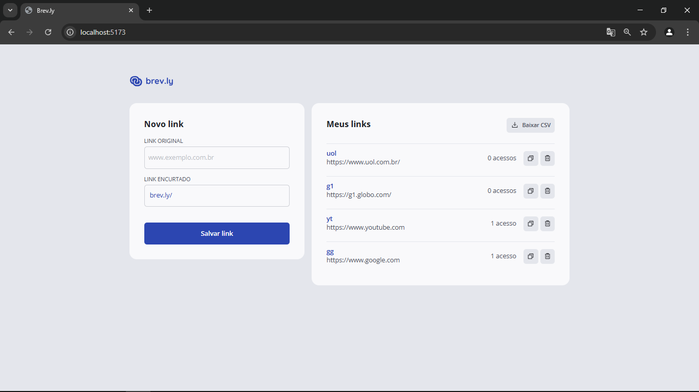
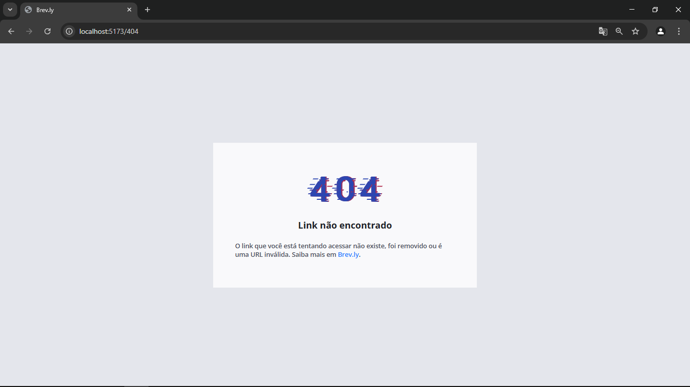

# Brev.ly - Encurtador de URL 🔗


Seja bem-vindo ao **Brev.ly**, um projeto FullStack desenvolvido como parte do desafio prático da primeira fase da Pós Tech Developer da [Faculdade de Tecnologia da Rocketseat](https://www.rocketseat.com.br/faculdade). O objetivo principal deste projeto é consolidar os conhecimentos adquiridos ao longo da pós-graduação e aplicá-los na construção de uma aplicação completa e funcional.


## 🚀 Sobre o Projeto

**Brev.ly** é um encurtador de URLs moderno, desenvolvido com foco em simplicidade, desempenho e experiência do usuário. Permite criar links curtos personalizados, acompanhar estatísticas de acesso e gerenciar URLs de forma eficiente.

## 📸 Preview do Projeto
Abaixo estão algumas capturas de tela do Brev.ly em funcionamento:

<p align="center">
  
  <br/>
  <em>Tela inicial com formulário de encurtamento</em>
</p>
<p align="center">
  
  <br/>
  <em>Listagem de URLs cadastradas</em>
</p>
<p align="center">
  
  <br/>
  <em>Redirecionamento para o endereço original</em>
</p>
<p align="center">
  
  <br/>
  <em>Página para URL não cadastrada</em>
</p>


## ✨ Funcionalidades
 - Criação de URLs curtas personalizadas.
 - Redirecionamento automático para a URL original.
 - Exibir lista de URLs encurtadas.
 - Remover um link encurtado.
 - Exibir estatísticas de acessos por link.
 - Interface responsiva e intuitiva.​


## 🛠️ Tecnologias Utilizadas
### Frontend
 - React.
 - TypeScript.
 - Zustand.
 - Tailwind CSS.
 - React Router.
 - Phosphor-icons.
 - Axios

### Backend
 - Fastify.
 - TypeScript.
 - Zod.
 - Swagger.
 - Drizzle ORM.
 - Vitest.
 - Postgres


## 🖥️ Instalação e Execução
### Pré-requisitos
 - Node.js (versão 22.14 ou superior);
 - Gerenciador de pacotes pnpm;
 - Docker e docker-compose

### Etapas de configuração:

#### 1. Clone o repositório e acesse o diretório do projeto:
```bash
git clone https://github.com/Igor2502/Brev.ly.git
cd brevly
```

---

#### 2. Backend
 - 2.1 Navegue até o diretório ``server``:
```bash
cd server
```

 - 2.2 Instale as dependências:
```bash
pnpm install
```

 - 2.3 Crie um arquivo ``.env`` com as variáveis de ambiente necessárias (exemplo disponível em ``.env.example``).
 ```bash
cp .env.example .env
 ```

 - 2.4 Suba os containers do banco de dados:
```bash
docker-compose up -d
```

 - 2.5 Execute as migrations para atualizar a estrutura do banco de dados:
```bash
pnpm run db:migrate
```

 - 2.6 Inicie o servidor:
```bash
pnpm run dev
```

 - 2.7 Caso tudo tenha dado certo você terá recebido o seguinte retorno:
```bash
Server is running on http://localhost:3333
Press CTRL+C to stop the server
```

---

#### 3. Frontend
 - 3.1 Navegue até o diretório ``web``:
```bash
cd web
```

 - 3.2 Instale as dependências:
```bash
pnpm install
```

 - 3.3 Inicie a aplicação:
```bash
pnpm run dev
```

 - 3.4 Caso tudo tenha dado certo você terá recebido o seguinte retorno:
```bash
  VITE v6.3.2  ready in 1421 ms

  ➜  Local:   http://localhost:5173/
  ➜  Network: use --host to expose
  ➜  press h + enter to show help
```

## 📦 Estrutura do Projeto

O projeto segue a seguinte estrutura de arquivos:
```
Brev.ly/
├── server/           # Backend com Fastify
│   ├── routes/       # Rotas da API
│   ├── services/     # Lógica de negócios
│   └── ...
├── web/              # Frontend com React
│   ├── components/   # Componentes reutilizáveis
│   ├── pages/        # Páginas da aplicação
│   ├── store/        # Gerenciamento de estado com Zustand
│   └── ...
└── README.md         # Documentação do projeto

```


## 📄 Documentação da API

A documentação interativa da API está disponível via Swagger, após iniciar o backend acesse o seguinte endpoint:
```
http://localhost:3000/docs
```


## 👨‍🎨 Créditos de Design

O layout e a identidade visual utilizados neste projeto foram baseados no design disponibilizado via [Figma](https://www.figma.com/community/file/1477335071553579816/encurtador-de-links) pelos instrutores do curso. Todos os direitos de design pertencem aos respectivos autores e à instituição responsável pelo desafio.

Agradecimentos especiais aos responsáveis pelo protótipo que inspirou esta aplicação.💜


## 🤝 Contribuição

Contribuições são bem-vindas! Sinta-se à vontade para abrir issues ou pull requests com melhorias, correções ou novas funcionalidades.


## 📄 Licença
Este projeto está licenciado sob a [MIT License](./LICENSE).


## 👨‍💻 Autor
Desenvolvido com ❤️ por [👨‍🚀Igor](https://www.linkedin.com/in/igor-gomes-da-silva/) como parte do desafio técnico da [FTR 🚀](https://www.rocketseat.com.br/faculdade).

<br>

---
> "Faça ou não faça. Tentativa não há."
> — Yoda ⚔️
---